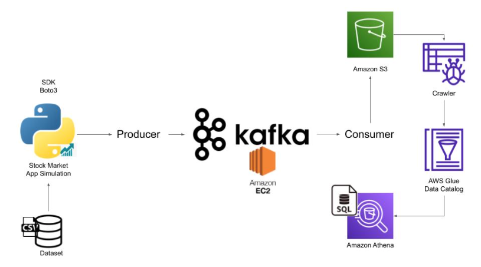

**Part 1 - Prerequisites**:

- The prerequisites for the project include having a laptop with an internet connection, Python installed, and an AWS account.
- Jupyter Notebook is recommended for writing and running code interactively.

**Part 2 - Understanding Kafka**:

- Kafka is introduced as a distributed event store and stream processing platform.
- Kafka operates using a producer-consumer model, where producers generate data, and consumers read and process that data.
- Kafka clusters consist of multiple brokers (servers) that work together.
- Zookeeper is introduced as a coordination service that helps manage Kafka clusters.
- Topics are logical categories within Kafka where data is stored.
- Topics can be divided into partitions, and data is continuously appended to partitions in log files.

**Part 3 - Project Execution**:

- The project involves simulating stock market data, producing data, pushing it to a Kafka broker, consuming the data, storing it on Amazon S3, crawling the data to build an AWS Glue catalog, and analyzing the data with Amazon Athena.
- Data is initially read from a static dataset.
- A Python script simulates a stock market application by producing data, which is then sent to a Kafka broker.
- A consumer script reads the data from Kafka and stores it in Amazon S3, an object storage service.
- An AWS Glue Crawler is run to extract schema information from the stored data, building a catalog.
- Amazon Athena is used to query and analyze the data stored on Amazon S3.

This project provides hands-on experience with real-time data streaming and demonstrates the integration of various technologies, including Kafka, AWS services, and Python. It emphasizes the importance of understanding the basics of Kafka and its key components to work with streaming data effectively. The video also encourages viewers to explore and troubleshoot on their own when facing errors or challenges during the project.
The flow chart you've described illustrates the process of creating a software application, and it outlines the various stages involved in its development. Here's a brief overview of each stage and its purpose:

1. **Database**: This stage involves designing and managing the application's database. It's where data is stored, organized, and made accessible to other parts of the application.

2. **Producer**: The producer stage is responsible for creating and managing the content or data that the application will provide. This could include content generation, data processing, and other production-related activities.

3. **Kafka**: In this stage, Kafka, a distributed streaming platform, is integrated into the application. Kafka is used for real-time data streaming and processing, allowing data to flow seamlessly between various components of the application.

4. **Consumer**: The consumer stage is responsible for receiving and processing the data or content produced by the producer. This stage prepares the data for presentation to end-users.

5. **Amazon S3**: This stage involves using Amazon S3, a cloud storage service, to store and retrieve application content. Amazon S3 is known for its scalability, durability, and reliability in storing large volumes of data.

6. **Creator**: The creator stage is where the final product is assembled. This could involve combining the processed data from the consumer stage, integrating it with other components, and preparing it for deployment.

7. **Consumer**: In the final stage, end-users interact with the application. They access the application, consume its content, and use its features through various devices, including computers and cell phones.

The flow chart likely represents the entire software development lifecycle, from data creation and storage to content generation, processing, and delivery to end-users. Various tools and technologies are involved in each stage to ensure the successful development and deployment of the application.

Amazon Athena and AWS Glue Crawler are two AWS services that are often used together for data analytics and processing. Here's an overview of each service:

1. **Amazon Athena**:

   - Amazon Athena is an interactive query service provided by AWS. It allows you to run SQL queries directly on data stored in Amazon S3 (Simple Storage Service) without the need for a dedicated database or data warehouse.
   - Athena is serverless, meaning you don't have to manage infrastructure. You only pay for the queries you run, making it a cost-effective solution.
   - It's particularly well-suited for ad-hoc queries and data exploration.

2. **AWS Glue Crawler**:
   - AWS Glue Crawler is part of AWS Glue, which is a managed ETL (Extract, Transform, Load) service. Glue Crawler is responsible for discovering and cataloging metadata about your data sources, including databases and data stored in Amazon S3.
   - When you point a Glue Crawler at a data source, it automatically identifies the schema and structure of the data and creates metadata tables in the AWS Glue Data Catalog. This metadata is then used by various AWS services, including Athena.
   - Glue Crawler is especially useful when you have large amounts of data stored in S3, and you want to make that data queryable with services like Athena or Amazon Redshift.

The typical workflow involving Athena and Glue Crawler looks like this:

1. **Set Up Data in Amazon S3**: Store your data in Amazon S3. This could be data in various formats like CSV, Parquet, JSON, or any other format.

2. **Create an AWS Glue Crawler**: Configure a Glue Crawler to scan your data source in Amazon S3. The Crawler will discover the schema and create table definitions.

3. **Catalog Data**: Once the Glue Crawler completes its scan, it catalogs the data in the AWS Glue Data Catalog, making the metadata available for other AWS services like Athena.

4. **Query with Amazon Athena**: You can use Athena to run SQL queries on the cataloged data. Athena leverages the metadata and schema information created by the Glue Crawler to make querying the data in S3 simple.

This combination of services makes it easy to discover and query data in Amazon S3 without the need for a separate data warehousing solution. It's particularly useful for data analytics, business intelligence, and other scenarios where you need to analyze and gain insights from large datasets.
